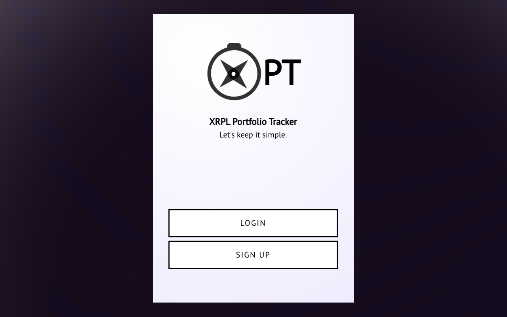
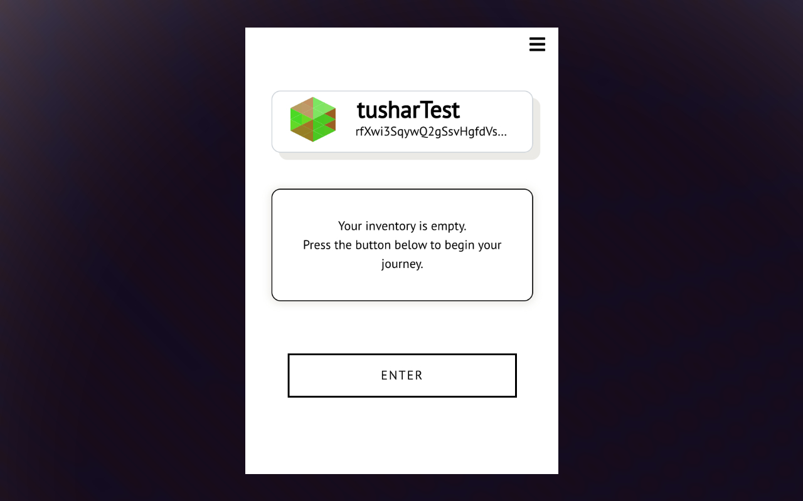
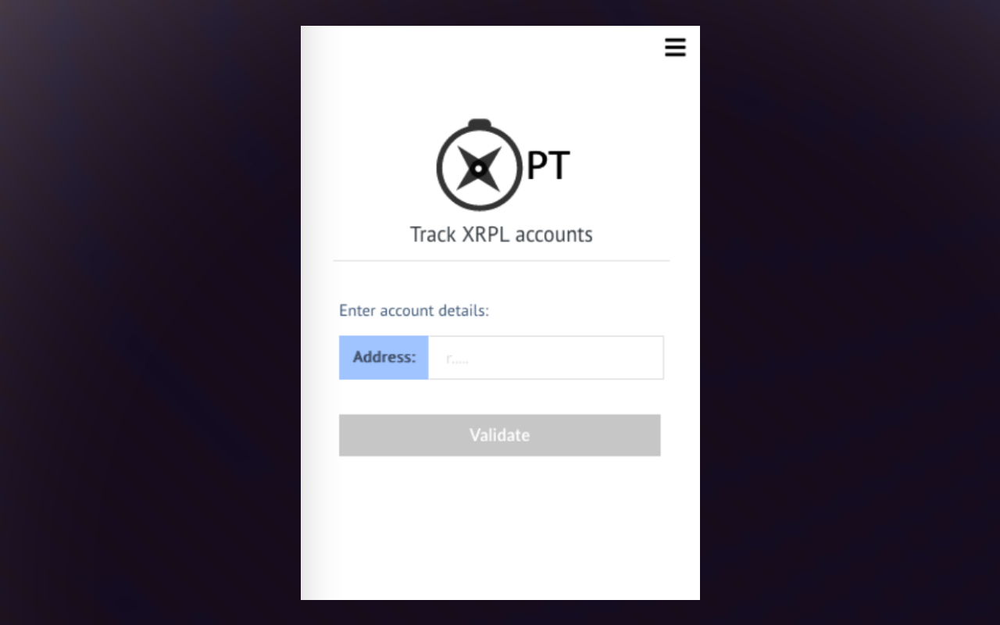
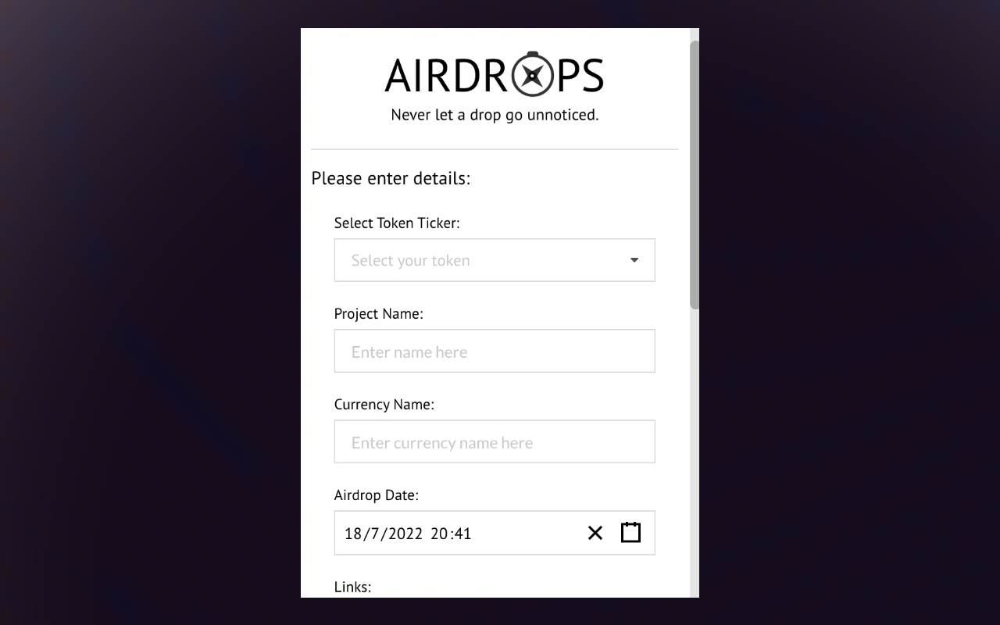
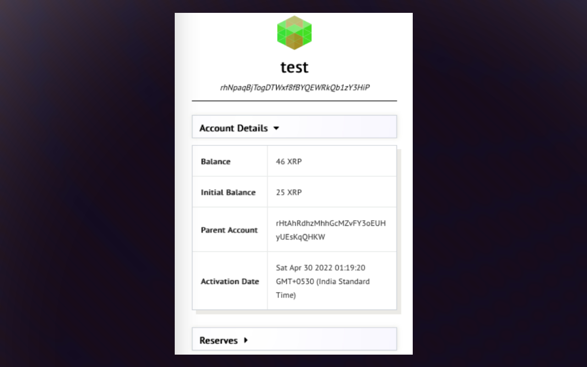

# XPT Browser Extension

A simple browser plugin built with ReactJs that allows users to save and monitor their XRP ledger accounts in real-time, visit this [link](https://xptxrpl.com/#/) to know more about the extension. All the features are listed below:

Related Repositories:
1. [XPT Backend](https://github.com/TusharPardhe/xpt-backend)
2. [XRPL Cheat Sheet](http://sheet.xptxrpl.com/)

## How to install?

1. Click on the releases section. (Located towards the left side of your github screen under about section)
2. Download dist.zip
3. Unpack dist.zip and delete the zip file.
4. Open your chrome browser and go to settings -> extensions, 
5. When you are on extension settings enable developer mode from the top right corner slider.
5. Now click "Load Unpacked" button on the left corner of the page and select the unpacked dist folder from step 3.

You are all set to use XPT :)

## Screenshots

## Features

- Account Details: 
  - Balance
  - Initial account balance 
  - Parent account address 
  - Date of creation etc.
  - Number of trustlines 
  - Currency ticker 
    - Issuer account etc.

- Issued Tokens: 
    - Number of tokens issued 
    - Ticker 
    - Issued supply

- Transaction details:
    - Date of transaction
    - Amount
    - Type of transaction
    - Tx hash
    - Other important transaction details

- XRPL Tokens
    - Real-time price update
    - Circulating supply
    - 24hr price change
    - Market cap
    - Current Marketcap
    - Total supply
    - etc.

- NFT Visualiser **(After XLS20D is live)
    - View your NFT Jpeg/Png etc
    - Check current price etc.

- XRPL Cheat Sheet [sheet.xptxrpl.com](http://sheet.xptxrpl.com/)
    - XRPL Projects
    - XRPScan, Bithomp, Xumm wallet Information
    - Code snippets, Open source projects etc.
    - Social media links: Discord handles, Twitter accounts etc.
    - API details, Libraries, Packages etc.
